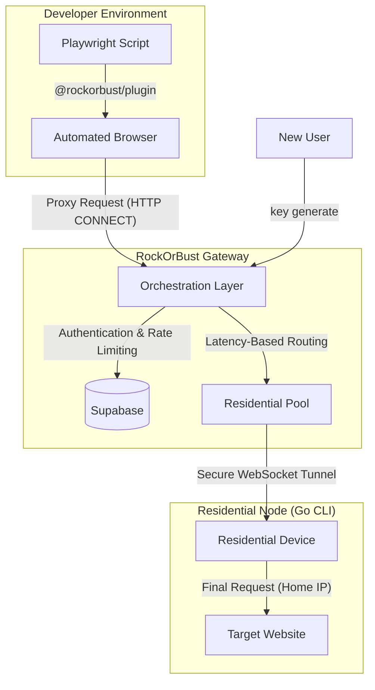

# RockOrBust

**Industrial-grade residential proxy infrastructure for browser automation.**

RockOrBust is a high-performance stealth network designed to help automated browsers bypass modern bot detection systems. By combining a private residential node pool with advanced browser fingerprinting spoofing, it allows your automation scripts to appear as legitimate human users.

---



---

## 🔌 System Interfaces

| Interface | Type | Usage |
| :--- | :--- | :--- |
| **Proxy Gateway** | `HTTP CONNECT` | Entry point for Playwright scripts and browser traffic. |
| **Auth API** | `REST (JSON)` | Handles key generation and validation via `/auth/register`. |
| **Node Tunnel** | `WebSocket` | Secure persistent tunnel for Residential CLI nodes. |

---

## System Architecture

The project consists of three integrated components:

1.  **[Gateway (apps/gateway)](./apps/gateway)**: A Node.js orchestration layer that manages authentication, node telemetry, and latency-based routing.
2.  **[Residential CLI (apps/cli)](./apps/cli)**: A standalone Go executable that contributes residential connections to the proxy pool.
3.  **[Playwright Plugin (packages/playwright-plugin)](./packages/playwright-plugin)**: A drop-in Playwright wrapper that automates stealth script injection and proxy configuration.

## Key Capabilities

- **Residential IP Routing**: Route traffic through real home connections to avoid datacenter IP reputation flags.
- **Latency-Based Selection**: The Gateway automatically prioritizes nodes with optimal response times for high-performance scraping.
- **Browser Fingerprint Spoofing**: Automatically masks `navigator.webdriver`, spoofs hardware concurrency, and mocks Chromium runtime properties to hide automation signals.
- **Transparent Integration**: Maintain your existing Playwright logic while gaining advanced stealth capabilities.
- **Resilient Fallback**: Optional VPS failover ensures connectivity even when the residential pool is undersized.

## Getting Started

### 1. Deploy the Gateway
Host the gateway on a VPS or use the managed instance at `https://robapi.buildshot.xyz/`.

### 2. Configure a Residential Node
No account registration is required. Simply download the CLI and use the following commands:

| Command | Description |
| :--- | :--- |
| `rockorbust key generate` | Securely requests and saves a new unique access key from the gateway. |
| `rockorbust key show` | Displays the current access key saved on the device. |
| `rockorbust key set <key>` | Manually links your device to an existing `rob_` key. |
| `rockorbust rock` | Launches the residential node as a background daemon. |
| `rockorbust status` | Displays the current connection health and process ID. |
| `rockorbust bust` | Gracefully terminates the background daemon. |

```bash
# Example: Quick Start
rockorbust key generate
rockorbust rock
```

### 3. Integrate with Playwright
Install the plugin in your project:
```bash
npm install @rockorbust/playwright-plugin
```

```typescript
import { chromium } from '@rockorbust/playwright-plugin';

const browser = await chromium.launch({
  rockorbust: { 
    key: process.env.ROB_KEY 
  }
});
```

## Documentation

- **[Gateway Configuration](./apps/gateway/README.md)**
- **[CLI User Guide](./apps/cli/README.md)**
- **[Playwright Plugin Documentation](./packages/playwright-plugin/README.md)**

---

MIT © [BuildShot](https://buildshot.xyz)