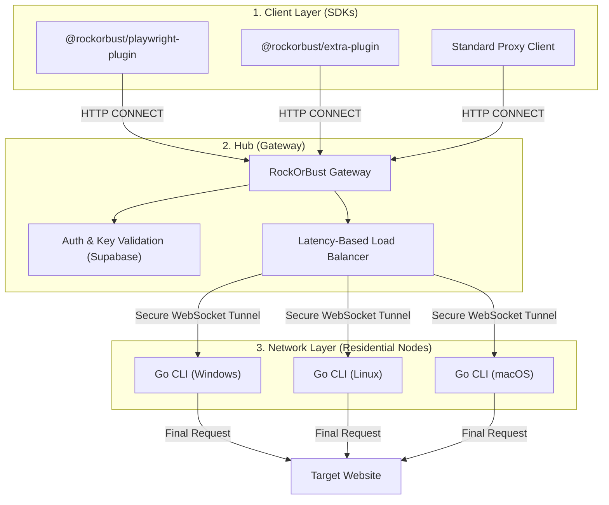

# RockOrBust

**The open-source decentralized residential proxy infrastructure for browser automation.**

RockOrBust is an industrial-grade, open-source stealth network designed to help automated browsers bypass advanced anti-bot systems. By leveraging a decentralized pool of residential nodes and sophisticated fingerprint masking, your automation scripts become indistinguishable from real human users.

---

## System Architecture



---

## The Three Pillars

### 1. The Network (Go CLI)
A high-performance standalone binary that contributes residential connections to the pool. 
- **Privacy:** Traffic is encrypted and tunneled securely.
- **Cross-Platform:** Native binaries for Windows, Linux, and macOS.
- **Background Persistence:** Runs as a lightweight daemon with built-in autostart.

### 2. The Hub (Gateway)
The central orchestration layer that handles authentication and routing.
- **Latency-Based Selection:** Automatically routes traffic through the fastest available node.
- **IP Rotation:** Every request can hit a different residential IP.
- **Reputation Protection:** Optional local fallback to protect your Gateway's VPS IP.
- **ROB Key Auth:** Simple, secure key-based authentication.

### 3. The SDKs (Plugins)
Drop-in libraries for Playwright and Puppeteer.
- **Native Plugin:** Zero-dependency, all-in-one wrapper with built-in stealth scripts.
- **Extra Plugin:** Modular plugin for the playwright-extra and puppeteer-extra ecosystem.

## Quick Start

### 1. The Network (Go CLI)
Download the binary for your platform and run it with your ROB key:
```bash
./rockorbust --key rob_your_key_here
```

### 2. Choose Your SDK

#### Option A: Native Plugin (All-in-One)
Best for clean, zero-dependency setups with built-in stealth scripts.
```bash
npm install @rockorbust/playwright-plugin
```
```javascript
const { chromium } = require('@rockorbust/playwright-plugin');

(async () => {
  const browser = await chromium.launch({
    rockorbust: { key: 'rob_your_key_here' }
  });
  const page = await browser.newPage();
  await page.goto('https://api.ipify.org?format=json');
  console.log(await page.content());
  await browser.close();
})();
```

#### Option B: Extra Plugin (Modular)
Best for existing `puppeteer-extra` or `playwright-extra` projects.
```bash
npm install @rockorbust/extra-plugin
```
```javascript
const { chromium } = require('playwright-extra');
const rockorbust = require('@rockorbust/extra-plugin')({
  key: 'rob_your_key_here',
  fallbackToLocal: true
});

chromium.use(rockorbust);

(async () => {
  const browser = await chromium.launch();
  const page = await browser.newPage();
  await page.goto('https://api.ipify.org?format=json');
  console.log(await page.content());
  await browser.close();
})();
```

---

## SDK Comparison

| Feature | Native Plugin | Extra Plugin |
| :--- | :--- | :--- |
| **Best For** | High-performance, zero-dependency setups. | Modular setups with other "Extra" plugins. |
| **Installation** | `@rockorbust/playwright-plugin` | `@rockorbust/extra-plugin` |
| **Stealth** | **Built-in**: Native JS mocks for WebGL, UA, etc. | **External**: Use with `puppeteer-extra-plugin-stealth`. |
| **Compatibility** | Playwright Only | Playwright-Extra & Puppeteer-Extra |
| **Fallback Options** | VPS or Local Machine | VPS or Local Machine |

---

## Smart Error Handling
Both plugins feature **Reactive Error Diagnostics**. If a connection fails due to a lack of residential nodes, RockOrBust will identify the cause and provide a helpful troubleshooting tip directly in your console.

---

## Project Structure

- **`apps/gateway`**: The Node.js hub for routing and auth.
- **`apps/cli`**: The Go-based residential node client.
- **`packages/playwright-plugin`**: The native Playwright wrapper.
- **`packages/extra-plugin`**: The modular Puppeteer/Playwright-Extra plugin.

---

## Documentation

- [Gateway Configuration](./apps/gateway/README.md)
- [CLI User Guide](./apps/cli/README.md)
- [SDK Reference](./packages/playwright-plugin/README.md)

---

MIT © [BuildShot](https://buildshot.xyz)