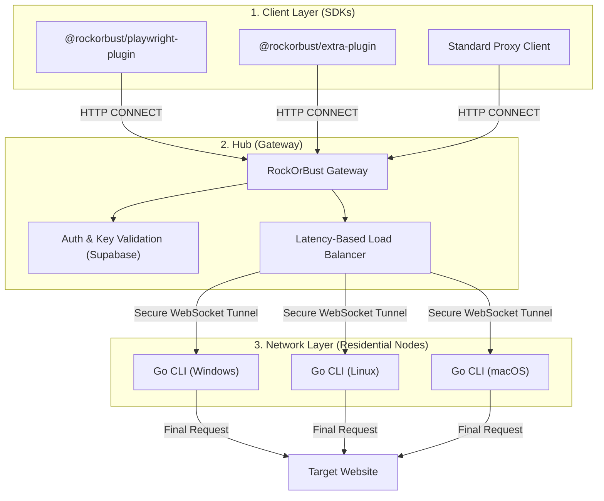

# RockOrBust

**The open-source decentralized residential proxy infrastructure for browser automation.**

RockOrBust is an industrial-grade, open-source stealth network designed to help automated browsers bypass advanced anti-bot systems. By leveraging a decentralized pool of residential nodes and sophisticated fingerprint masking, your automation scripts become indistinguishable from real human users.

---

## System Architecture



---

## The Three Pillars

### 1. The Network (Go CLI)
A high-performance standalone binary that contributes residential connections to the pool. 
- **Privacy:** Traffic is encrypted and tunneled securely.
- **Cross-Platform:** Native binaries for Windows, Linux, and macOS.
- **Background Persistence:** Runs as a lightweight daemon with built-in autostart.

### 2. The Hub (Gateway)
The central orchestration layer that handles authentication and routing.
- **Latency-Based Selection:** Automatically routes traffic through the fastest available node.
- **IP Rotation:** Every request can hit a different residential IP.
- **ROB Key Auth:** Simple, secure key-based authentication.

### 3. The SDKs (Plugins)
Drop-in libraries for Playwright and Puppeteer.
- **Native Plugin:** Zero-dependency, all-in-one wrapper with built-in stealth scripts.
- **Extra Plugin:** Modular plugin for the playwright-extra and puppeteer-extra ecosystem.

---

## Choosing Your SDK

| Feature | Native Plugin | Extra Plugin |
| :--- | :--- | :--- |
| **Best For** | High-performance, zero-dependency setups. | Modular setups with other "Extra" plugins. |
| **Installation** | `@rockorbust/playwright-plugin` | `@rockorbust/extra-plugin` |
| **Stealth** | **Built-in**: Native JS mocks for WebGL, UA, etc. | **External**: Use with `puppeteer-extra-plugin-stealth`. |
| **Ecosystem** | Standalone | Puppeteer-Extra / Playwright-Extra |

---

## Quick Start

### 1. Start a Residential Node (Go CLI)
Generate a key and start the node.

```bash
# Generate your unique ROB key
rockorbust key generate

# Start the residential node in the background
rockorbust rock
```

### 2. Automate (Playwright)
Install your preferred SDK:

```bash
npm install @rockorbust/playwright-plugin
```

```javascript
const { chromium } = require('@rockorbust/playwright-plugin');

(async () => {
  const browser = await chromium.launch({
    rockorbust: { key: process.env.ROB_KEY }
  });
  const page = await browser.newPage();
  await page.goto('https://checkip.amazonaws.com');
  await browser.close();
})();
```

> [!TIP]
> Use the **Extra Plugin** if you need to combine RockOrBust with other plugins like Adblockers or CAPTCHA solvers.

---

## Project Structure

- **`apps/gateway`**: The Node.js hub for routing and auth.
- **`apps/cli`**: The Go-based residential node client.
- **`packages/playwright-plugin`**: The native Playwright wrapper.
- **`packages/extra-plugin`**: The modular Puppeteer/Playwright-Extra plugin.

---

## Documentation

- [Gateway Configuration](./apps/gateway/README.md)
- [CLI User Guide](./apps/cli/README.md)
- [SDK Reference](./packages/playwright-plugin/README.md)

---

MIT © [BuildShot](https://buildshot.xyz)